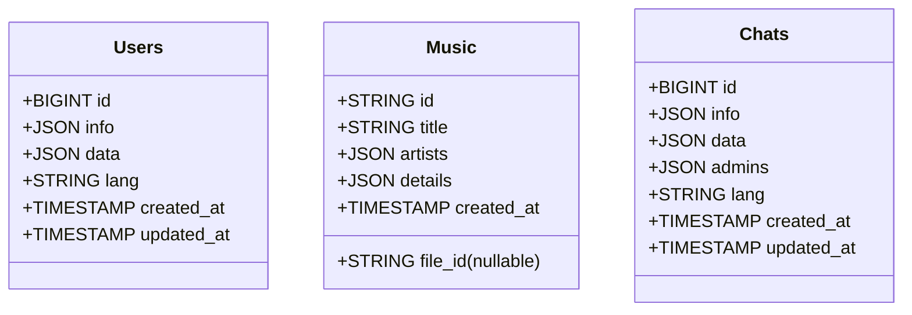

# Ripple Button for React

A **React** component that mimics the native ripple effect seen in **Android** apps. The button provides a smooth, interactive experience with a ripple animation when clicked. It is designed to feel natural and familiar, just like native Android buttons.

## Features

- **Native-like Ripple Effect**: The ripple effect behaves exactly like the one in Android, offering a familiar user experience.
- **Easy to Use**: Drop the component into your project with minimal setup.

## Demo
- [Ripple Button Demo](https://Enalite.github.io/RippleButton-react/)

## Installation

### 1. Clone the Repository

First, clone the repository to your local machine using the following command:

```bash
git clone https://github.com/Enalite/RippleButton-react.git
```

### 2. Install Dependencies

Navigate to the project directory and run the following command to install the necessary dependencies:

```bash
cd RippleButton-react
npm install
```

### 3. Import the Component into Your Project

You can use this ripple button in any React project. Simply import the `RippleButton` component like so:

```jsx
import RippleButton from "./components/Ripple";
```

Then, use the component in your app:

```jsx
import React from 'react';
import RippleButton from "./components/Ripple";

function App() {
  return (
    <div className="App">
      <RippleButton onClick={() => alert('Button clicked!')}>
        Click Me
      </RippleButton>
    </div>
  );
}

export default App;
```

## Usage

1. After installing and importing the component, simply use it like any other React component.
2. Customize the button's size, color, or any other property through props.

### Example:

```jsx
/** @jsxImportSource @emotion/react */
import React from "react";
import RippleButton from "./components/Ripple";
import { css } from "@emotion/react";

const App = () => {
    const pageStyle = css`
        background: #9dbfff;
        color: #ffffff;
    `;

    return (
        <div className="flex flex-center height-100 width-100 flex-column flex-gap-md" css={pageStyle}>
            <h2>Ripple button example</h2>
            <RippleButton>
                Click me
            </RippleButton>
        </div>
    )
}

export default App;
```

## License

This project is licensed under the MIT License - see the [LICENSE](LICENSE) file for details.

## Additional Information

- **Technology Used**: React, CSS (for animations)
- **Compatibility**: Works with React 16+ and above.
- **Responsiveness**: Fully responsive and optimized for mobile and desktop views.

---

Happy coding! Enjoy the smooth ripple effect in your applications.


<details>  
<summary>Database Schema (Mermaid ERD)</summary>  



</details>
